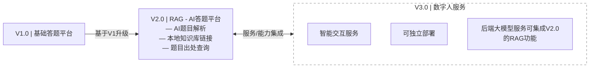
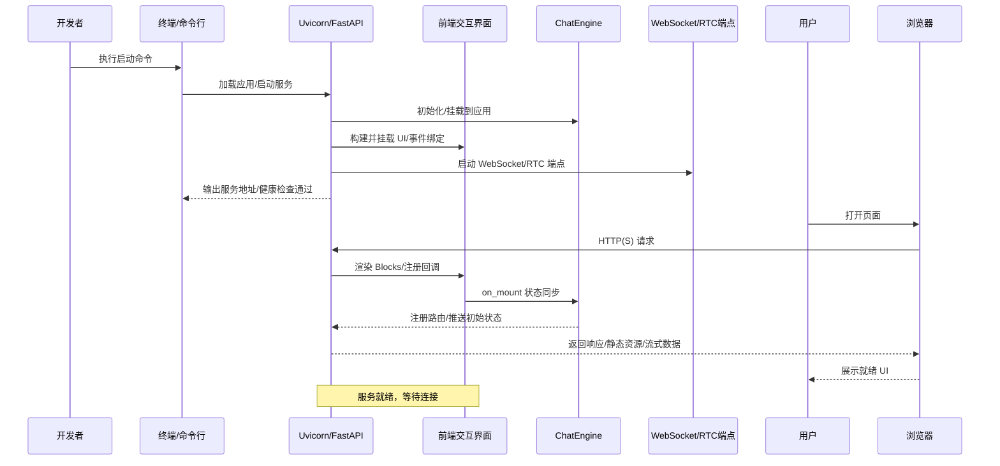
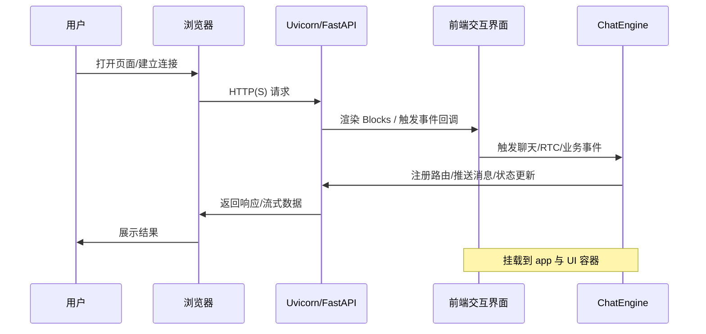
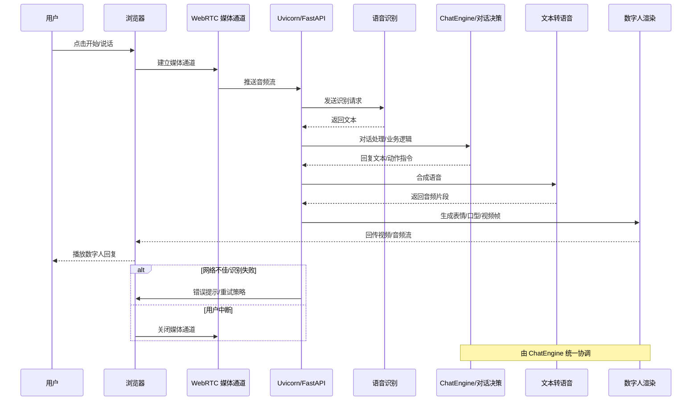

## 项目迭代

```mermaid
flowchart LR
    V1["V1.0 | 基础答题平台"]
    V2["V2.0 | RAG - AI答题平台<br/>— AI题目解析<br/>— 本地知识库链接<br/>— 题目出处查询"]

    subgraph V3SG["V3.0 | 数字人服务"]
        direction TB
        V3A[智能交互服务]
        V3B[可独立部署]
        V3C[后端大模型服务可集成V2.0的RAG功能]
    end
    style V3SG stroke-dasharray: 5 5,stroke:#888,fill:#fff

    V1 -->|基于V1升级| V2

    V2 <--> |服务/能力集成| V3SG
```

## 项目运行逻辑

```mermaid
sequenceDiagram
    participant D as 开发者
    participant CLI as 终端/命令行
    participant Uv as Uvicorn/FastAPI
    participant Gr as 前端交互界面
    participant CE as ChatEngine
    participant WS as WebSocket/RTC端点
    participant U as 用户
    participant B as 浏览器

    D->>CLI: 执行启动命令
    CLI->>Uv: 加载应用/启动服务
    Uv->>CE: 初始化/挂载到应用
    Uv->>Gr: 构建并挂载 UI/事件绑定
    Uv->>WS: 启动 WebSocket/RTC 端点
    Uv-->>CLI: 输出服务地址/健康检查通过

    U->>B: 打开页面
    B->>Uv: HTTP(S) 请求
    Uv->>Gr: 渲染 Blocks/注册回调
    Gr->>CE: on_mount 状态同步
    CE-->>Uv: 注册路由/推送初始状态
    Uv-->>B: 返回响应/静态资源/流式数据
    B-->>U: 展示就绪 UI

Note over Uv,Gr: 服务就绪，等待连接
```

## 前后端协作逻辑

```mermaid
sequenceDiagram
    participant U as 用户
    participant B as 浏览器
    participant Uv as Uvicorn/FastAPI
    participant Gr as 前端交互界面
    participant CE as ChatEngine

    U->>B: 打开页面/建立连接
    B->>Uv: HTTP(S) 请求
    Uv->>Gr: 渲染 Blocks / 触发事件回调
    Gr->>CE: 触发聊天/RTC/业务事件
    CE->>Uv: 注册路由/推送消息/状态更新
    Uv->>B: 返回响应/流式数据
    B->>U: 展示结果

    Note over CE,Gr: 挂载到 app 与 UI 容器
```

## 数字人服务逻辑

```mermaid
sequenceDiagram
    participant U as 用户
    participant B as 浏览器
    participant RTC as WebRTC 媒体通道
    participant Uv as Uvicorn/FastAPI
    participant ASR as 语音识别
    participant NLG as ChatEngine/对话决策
    participant TTS as 文本转语音
    participant AV as 数字人渲染

    U->>B: 点击开始/说话
    B->>RTC: 建立媒体通道
    RTC->>Uv: 推送音频流
    Uv->>ASR: 发送识别请求
    ASR-->>Uv: 返回文本
    Uv->>NLG: 对话处理/业务逻辑
    NLG-->>Uv: 回复文本/动作指令
    Uv->>TTS: 合成语音
    TTS-->>Uv: 返回音频片段
    Uv->>AV: 生成表情/口型/视频帧
    AV-->>B: 回传视频/音频流
    B-->>U: 播放数字人回复

    alt 网络不佳/识别失败
        Uv->>B: 错误提示/重试策略
    else 用户中断
        B->>RTC: 关闭媒体通道
    end

    Note over NLG,AV: 由 ChatEngine 统一协调
```
